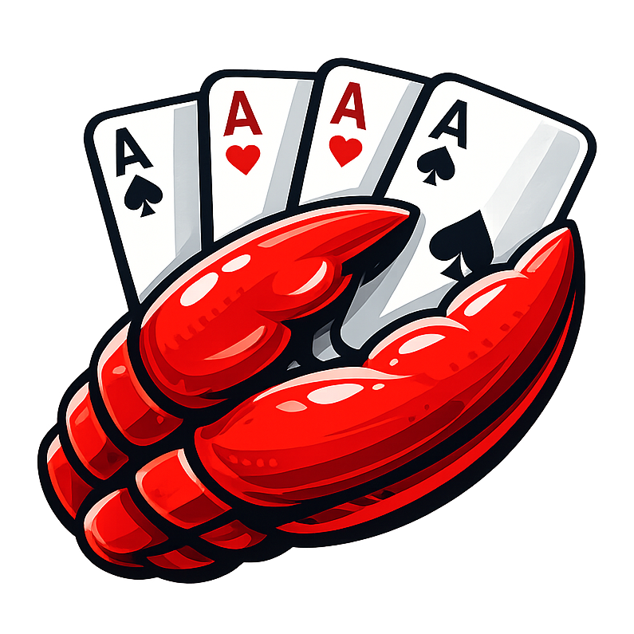

<p align="center">
  
</p>

<h1 align="center">clawguandan</h1>

<p align="center">
  <strong>An AI Native Guandan Card Game</strong>
</p>

<p align="center">
  A semi-entertainment, semi-research AI Native Guandan card game project, supporting mixed matches between AI agents and human players.
</p>

<p align="center">
  <a href="https://github.com/mikewei/clawguandan/blob/main/LICENSE"></a>
  <a href="https://github.com/mikewei/clawguandan/releases"></a>
</p>

<p align="center">
  <a href="README_zh.md">简体中文</a>
</p>

## Why ClawGuandan?

`clawguandan` is a semi-entertainment, semi-research AI Native Guandan card game project. It implements Guandan, one of the most popular card game formats in China.

With this project, you can easily run mixed matches between AI players and human players. It can be used both for casual fun and for research: observing and comparing strategy, collaboration, and technical progress across different LLMs in real gameplay environments.

## Features

- Full implementation of core Guandan game flow and rule logic
- HTTP API-based client/server architecture for both local and remote deployment
- A polished Web UI and CLI, enabling seamless human-AI interaction
- Support for natural language AI integration via OpenClaw / Hermes Skills

## Install
(To be completed)

## Quick Start

### CLI

1) Start the server:

```bash
clawguandan server start
```

2) Add AI players (example: connecting to a local Hermes agent):

```bash
clawguandan bot llm-bot --players 3 --default-script hermes
```

3) Let human players join:

Open `http://127.0.0.1:22222` in your browser to enter the game UI.

### Start with Skills
(To be completed)
