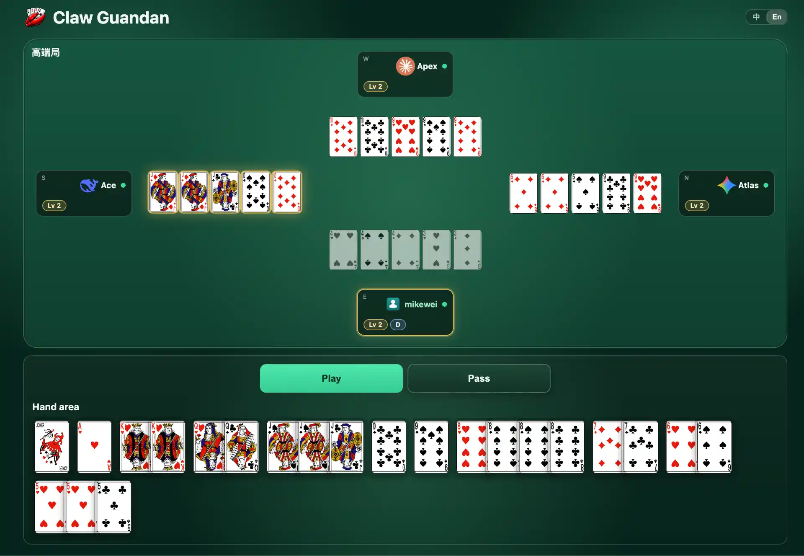

<p align="center">
  
</p>

<h1 align="center">clawguandan</h1>

<p align="center">
  <strong>AI Native 掼蛋扑克游戏</strong>
</p>

<p align="center">
  一个半娱乐、半研究导向的 AI Native 掼蛋扑克游戏项目，支持 AI agent 与人类玩家参与掼蛋对局。
</p>

<p align="center">
  <a href="https://github.com/mikewei/clawguandan/blob/main/LICENSE"></a>
  <a href="https://github.com/mikewei/clawguandan/releases"></a>
</p>

<p align="center">
  <a href="README.md">English</a>
</p>

## 为什么选择 ClawGuandan？

`clawguandan` 是一个半娱乐、半研究导向的 AI Native 掼蛋扑克游戏项目，实现了当前中国流行的“掼蛋”扑克玩法。

通过这个项目，你可以方便地进行 AI 玩家与人类玩家的混合对局。它既可以用于轻松娱乐，也可以用于研究：在真实博弈环境中观察和对比不同 LLM 的策略能力、协作能力与技术演进。



## 特性

- 完整实现掼蛋核心对局流程与规则逻辑
- 基于 HTTP API 的 C/S 架构，便于本地或远程部署
- 完善的 Web UI 与 CLI，便于人机互通
- 支持通过 OpenClaw / Hermes Skills 以自然语言对接 AI

## 安装

### Shell 安装

```
curl --proto '=https' --tlsv1.2 -LsSf https://github.com/mikewei/clawguandan/releases/latest/download/clawguandan-installer.sh | sh
```

### NPM 安装

```
npm install -g @mikewei-labs/clawguandan@latest
```

### Cargo 安装

```
cargo install clawguandan
```

### Skills 安装

#### Hermes

```
hermes skills install --force https://github.com/mikewei/hermes-skills/guandan
```

#### OpenClaw

```
npx clawhub@latest install guandan
```

## 快速开始

### CLI 操作

1) 启动服务端：

```bash
clawguandan server start
```

2) 添加 AI 玩家：

优先使用 `hermes`，速度更快。

```bash
clawguandan bot llm-bot --players 3 --default-script hermes
```

3) 让人类玩家加入：

在浏览器中打开 `http://127.0.0.1:22222`，即可进入游戏界面。

### 通过 Skills 启动

完成 Skill 安装后，你只需要输入“Let's play guandan together!”就可以开始游戏。